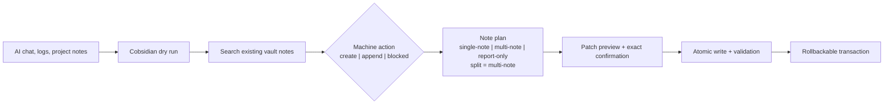
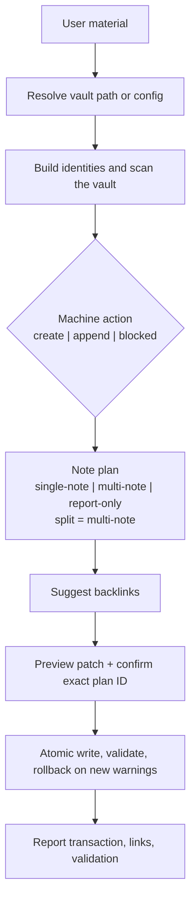

# Cobsidian

English · [简体中文](docs/README.zh-CN.md)

<p align="center">
  
</p>

<p align="center">
  <a href="https://github.com/Totoro-qaq/Cobsidian/actions/workflows/validate.yml"></a>
  <a href="https://github.com/Totoro-qaq/Cobsidian/actions/workflows/codeql.yml"></a>
  <a href="LICENSE"></a>
</p>

> Turn AI conversations into linked Obsidian knowledge, safely.

Cobsidian is an agent-agnostic workflow skill for maintaining an Obsidian or Markdown vault. It searches before creating, explains the proposed change, waits for exact confirmation, writes atomically, and validates the result.

It is not a hosted service or an Obsidian plugin. Your coding agent runs the workflow against a local folder of Markdown files.

[Quick Start](#quick-start) · [Install](#install) · [MCP Server](docs/mcp-server.md) · [Prompt Examples](examples/prompts.md) · [Agent Compatibility](docs/agent-compatibility.md)

Use the agent you already know: [Claude Code](skills/cobsidian/references/hosts/claude-code.md) · [Codex CLI](skills/cobsidian/references/hosts/codex.md) · [GitHub Copilot CLI](skills/cobsidian/references/hosts/github-copilot-cli.md) · [Kimi Code](skills/cobsidian/references/hosts/kimi-code.md) · [OpenCode](skills/cobsidian/references/hosts/opencode.md) · [Pi](skills/cobsidian/references/hosts/pi.md) · [Antigravity](skills/cobsidian/references/hosts/antigravity.md)

<p align="center">
  
</p>

<p align="center"><sub>Synthetic demo vault. No private notes, paths, or credentials.</sub></p>

## Quick Start

Run a read-only dry run against the bundled demo vault:

```bash
git clone https://github.com/Totoro-qaq/Cobsidian.git
cd Cobsidian
python skills/cobsidian/scripts/dry_run.py examples/demo-vault --topic "AI Conversations" --mode learning --text "agent workflow notes" --json
```

Then point your agent at `skills/cobsidian/SKILL.md`:

```text
Use Cobsidian to organize this material into my Obsidian vault.
Vault: /absolute/path/to/obsidian-vault
Run a dry run first, check duplicates, suggest backlinks, and wait for confirmation before writing.
```

## What Cobsidian Does

| Stage | What Cobsidian makes visible |
| --- | --- |
| Read | Resolves the vault and builds identities from filenames, H1s, titles, and aliases. |
| Decide | Reports `create | append | blocked` separately from note shape. |
| Review | Returns duplicate risk, backlink suggestions, and an exact patch plan. |
| Write | Requires the plan ID, writes atomically, validates, and keeps rollback available. |

The result is durable Markdown with useful `[[wiki links]]`, not a second copy of a note that already exists.

## Before / After



| Before | After |
| --- | --- |
| Useful answers disappear in chat history | Reusable notes stay in the vault |
| Repeated prompts create near-duplicates | Existing identities are checked first |
| Links are guessed while writing | Backlinks come from actual vault notes |
| Agent edits are hard to audit | A deterministic plan precedes every write |

## Dry-run Preview

Dry run is the default safe path. It reports the decision and leaves `writes` empty.

```json
{
  "dry_run": true,
  "mode": "learning",
  "decision": {
    "action": "append",
    "target_note": "AI Conversations.md"
  },
  "suggested_backlinks": [
    {
      "title": "Agent Workflows",
      "path": "Agent Workflows.md"
    }
  ],
  "writes": []
}
```

## Not Just Markdown Generation

| Ordinary Markdown generation | Cobsidian |
| --- | --- |
| Produces a standalone file | Maintains a linked knowledge system |
| Ignores existing notes | Scans the vault before writing |
| Mixes action and document shape | Separates machine action from note plan |
| Writes immediately | Plans, confirms, writes, validates, and can roll back |

## Knowledge Read / 整理判读

Before writing, Cobsidian computes a Knowledge Read: mode, depth, granularity, evidence, and display choice. `auto | always | off` controls conversational presentation only. With `off`, `display_style` is hidden while the complete JSON remains available in dry-run output.

Capability-based degradation keeps the result honest. A local host can become ready after checks, MCP remains read-only, and a chat-only host returns a draft or requests a usable path instead of claiming work it could not perform. Detailed rules live in the [mode and host references](skills/cobsidian/references/) and the shared [preflight contract](skills/cobsidian/references/preflight.md).

### Compact Knowledge Read

```json
{
  "mode": "learning",
  "mode_explicit": true,
  "recommended_modes": [],
  "depth": "standard",
  "granularity": "single-note",
  "evidence": "conversation",
  "display_policy": "auto",
  "display_style": "compact"
}
```

### Expanded Knowledge Read

```json
{
  "mode": "dissection",
  "mode_explicit": false,
  "recommended_modes": [],
  "depth": "deep",
  "granularity": "multi-note",
  "evidence": "source-grounded",
  "display_policy": "auto",
  "display_style": "expanded"
}
```

## Obsidian Vault Workflow



## Install

Requirements: Git, Python 3.10+, a Markdown vault, and a coding agent that can read local instructions and run commands.

Preview the destinations, then install the skill for supported CLIs:

```bash
python install_cobsidian.py --host all --scope user --dry-run --json
python install_cobsidian.py --host all --scope user
```

Or copy the shared skill manually:

```bash
mkdir -p ~/.agents/skills
cp -r skills/cobsidian ~/.agents/skills/cobsidian
```

See [INSTALL.md](INSTALL.md) for Windows, project-scoped, symlink, update, and uninstall instructions. See [Integrations](docs/integrations.md) for host discovery paths.

### MCP Server

Hosts with Model Context Protocol support can run Cobsidian as a local, read-only `stdio` server:

```bash
python -m pip install -r requirements-mcp.txt
python skills/cobsidian/mcp_server.py
```

Configure `COBSIDIAN_CONFIG` or `COBSIDIAN_VAULT`; see [MCP Server](docs/mcp-server.md).

## Agent Usage

Give the agent the workflow, the vault, and the safety boundary:

```text
Use Cobsidian to turn this conversation into an Obsidian learning note.
Check whether it should create a new note or append to an existing one.
Add useful wiki links, report possible duplicates, and wait before writing.
```

Copy-ready variants live in [Prompt Examples](examples/prompts.md).

## Modes

Cobsidian accepts an explicit mode or routes from natural language. Clear requests use one inferred mode; ambiguous requests recommend at most two relevant modes. See [Modes](docs/modes.md) and the detailed [mode references](skills/cobsidian/references/modes/).

## CLI Utilities

Deterministic helpers cover vault scanning, duplicate detection, backlink suggestions, validation, dry runs, transaction preparation, exact-plan application, and quality evaluation:

```bash
python skills/cobsidian/scripts/scan_vault.py /path/to/vault --json
python skills/cobsidian/scripts/find_duplicates.py /path/to/vault
python skills/cobsidian/scripts/suggest_backlinks.py /path/to/vault --file draft.md
python skills/cobsidian/scripts/validate_notes.py /path/to/vault
python skills/cobsidian/scripts/write_executor.py prepare /path/to/vault --action append --target-note "RAG.md" --content-file draft.md --plan-out /tmp/cobsidian-plan.json
python skills/cobsidian/scripts/write_executor.py apply /path/to/vault --plan /tmp/cobsidian-plan.json --confirm PLAN_ID --json
```

## Optional Config

`cobsidian.config.example.yml` is the current supported config surface. It covers the vault path, mode directories, Knowledge Read presentation, backlink limit, duplicate threshold, append preference, and validation behavior.

```yaml
interaction:
  knowledge_read: auto
```

Copy it to `cobsidian.config.yml`; helper scripts accept `--config cobsidian.config.yml`.

## Features

- Deterministic title and alias identity matching, including prefix-free core titles.
- CJK bigrams and trigrams for related-phrase matching.
- Missing wiki-link and similar-title validation.
- Paginated local MCP tools for inspection and dry-run planning.
- Integrity-hashed patches, exact confirmation, atomic writes, and rollback.
- Public quality evaluation for duplicate, backlink, append-target, and mode accuracy.

## Roadmap

- Semantic duplicate detection beyond title identity.
- Larger labeled-vault benchmarks for backlink ranking.
- Optional note templates and configurable naming rules.
- Optional Obsidian plugin integration after the workflow stabilizes.

## Contributing

Contributions are welcome. Read [CONTRIBUTING.md](CONTRIBUTING.md), and never include private vault content, local profile paths, API keys, unpublished notes, or personal screenshots.

## Trademark And Affiliation Notice

Cobsidian is an independent open-source project. OpenAI, Codex, Obsidian, Claude, Cursor, Hermes, and other names are trademarks of their respective owners. This project is not affiliated with, endorsed by, or sponsored by those owners.

## License

[MIT](LICENSE) © 2026 Totoro.
