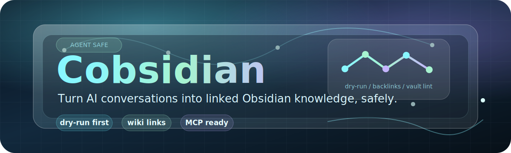
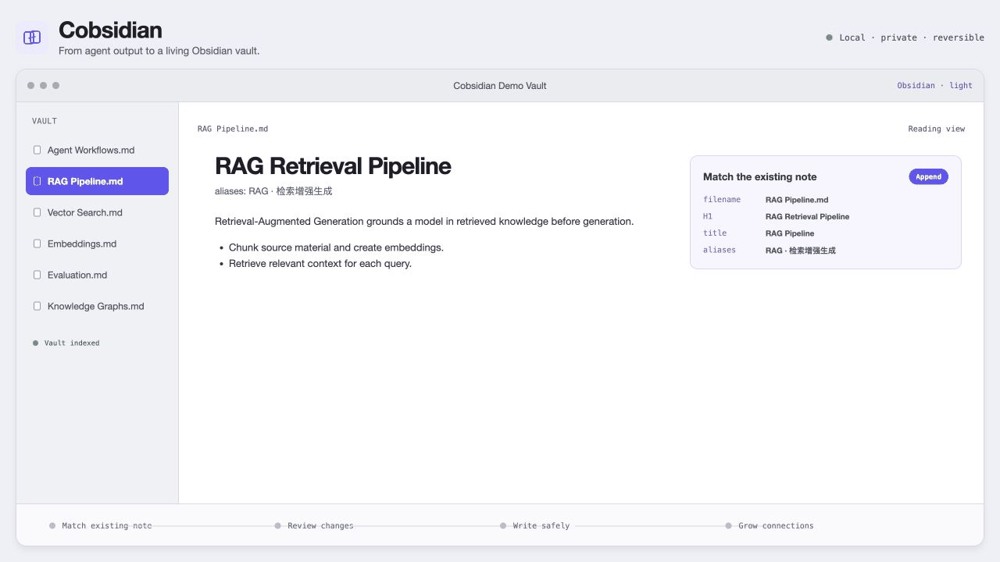
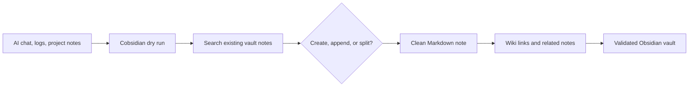
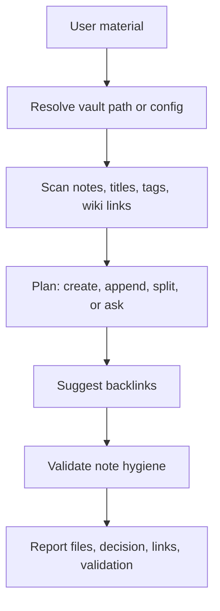

# Cobsidian

English | [简体中文](docs/README.zh-CN.md)

[](https://github.com/Totoro-qaq/Cobsidian/actions/workflows/validate.yml)
[](https://github.com/Totoro-qaq/Cobsidian/actions/workflows/codeql.yml)
[](LICENSE)

<p align="center">
  
</p>

> Turn AI conversations into linked Obsidian knowledge, safely.

Cobsidian is an agent-agnostic workflow skill for maintaining Obsidian or Markdown knowledge bases. It helps AI agents turn conversations, study material, logs, documents, and project analysis into durable notes with duplicate checks, wiki links, backlink suggestions, and basic vault validation.

[Quick Start](#quick-start) · [MCP Server](docs/mcp-server.md) · [Prompt Examples](examples/prompts.md) · [Agent Compatibility](docs/agent-compatibility.md)

<p align="center">
  
</p>

## What Cobsidian Does

- Turns useful AI conversations into reusable Markdown notes.
- Searches existing notes before writing so agents append or merge instead of creating duplicates.
- Keeps writes reviewable with dry-run planning, backlink suggestions, and validation output.

## Quick Start

```bash
git clone https://github.com/Totoro-qaq/Cobsidian.git
cd Cobsidian
python skills/cobsidian/scripts/dry_run.py examples/demo-vault --topic "AI Conversations" --text "agent workflow notes" --json
```

Then point your agent at `skills/cobsidian/SKILL.md` and give it your vault path or `cobsidian.config.yml`.

```text
Use Cobsidian to organize this material into my Obsidian vault.
Vault: /absolute/path/to/obsidian-vault
Run a dry run first, check duplicates, suggest backlinks, and wait for confirmation before writing.
```

## Before / After



| Before | After |
|---|---|
| Useful answers trapped in chat history | Durable notes in your vault |
| Isolated Markdown files | Linked notes with `[[wiki links]]` |
| Duplicate notes from repeated prompts | Create/append decisions based on existing notes |
| Agent writes that are hard to review | Dry-run plan before write actions |

## Dry-run Preview

Dry run is the default safe path: it plans the change, reports duplicate risks and backlinks, and keeps `writes` empty.

```json
{
  "dry_run": true,
  "mode": "learning",
  "decision": {
    "action": "append",
    "target_note": "AI Conversations.md"
  },
  "suggested_backlinks": [
    {
      "title": "Agent Workflows",
      "path": "Agent Workflows.md"
    }
  ],
  "writes": []
}
```

## Not Just Markdown Generation

| Ordinary Markdown generation | Cobsidian |
|---|---|
| Produces a standalone file | Maintains a linked knowledge system |
| Ignores existing notes | Scans the vault before writing |
| Often duplicates topics | Prefers append, merge, or split decisions |
| Adds links opportunistically | Suggests links from actual vault notes |
| Writes immediately | Supports dry-run review before edits |

## Obsidian Vault Workflow



## Features

- Create learning notes, project notes, comparison notes, and index notes.
- Check existing notes before writing to reduce duplicates.
- Suggest `[[wiki links]]` from note titles, metadata, and body text.
- Match Chinese related phrases with deterministic CJK bigrams and trigrams.
- Validate missing wiki-link targets.
- Detect exact and similar note titles.
- Keep note structure concise and reusable.
- Avoid writing private paths, secrets, or raw chat transcripts by default.
- Expose paginated local MCP tools for read-only vault inspection and dry-run planning.

## Install

See [INSTALL.md](INSTALL.md) for full setup, update, and uninstall instructions.
See [Integrations](docs/integrations.md) for Codex, Obsidian vault, MCP host, and other-agent setup notes.

### Codex Skill

```bash
mkdir -p ~/.agents/skills
cp -r skills/cobsidian ~/.agents/skills/cobsidian
```

On Windows PowerShell:

```powershell
New-Item -ItemType Directory -Force "$env:USERPROFILE\.agents\skills" | Out-Null
Copy-Item -Recurse -Force .\skills\cobsidian "$env:USERPROFILE\.agents\skills\cobsidian"
```

Codex currently documents `$HOME/.agents/skills` for user skills. Some local or older Codex builds may scan `$HOME/.codex/skills`; use the skills directory shown by your Codex surface.

### Other Agents

For Hermes, Claude Code, Cursor, and other agents, use the same core workflow:

1. Point the agent to `skills/cobsidian/SKILL.md`.
2. Allow it to call the helper scripts in `skills/cobsidian/scripts/`.
3. Ask it to report create/append decisions, duplicate checks, backlink changes, and validation results.

See [Agent Compatibility](docs/agent-compatibility.md) and [Integrations](docs/integrations.md).

### MCP Server

Cobsidian also ships a local MCP server for hosts that support the Model Context Protocol.

```bash
python -m pip install -r requirements-mcp.txt
python skills/cobsidian/mcp_server.py
```

Use it as a local `stdio` server and configure `COBSIDIAN_CONFIG` or `COBSIDIAN_VAULT`.

See [MCP Server](docs/mcp-server.md).

## Agent Usage

See [Prompt Examples](examples/prompts.md) for copy-ready prompts.

Ask your agent to use Cobsidian when you want to write into an Obsidian vault:

```text
Use Cobsidian to turn this conversation into an Obsidian learning note.
Check whether it should create a new note or append to an existing one.
Add useful wiki links and report possible duplicates.
```

More examples:

```text
Use Cobsidian to summarize these logs into my Obsidian vault.
Preserve only reusable lessons, check for existing related notes, and add backlinks.
```

```text
Use Cobsidian to compare these two project attempts and write a comparison note.
If a related note already exists, append instead of creating a duplicate.
```

## Modes

Cobsidian supports modes so users can tell the agent what kind of note they want.

| Mode | Use when | Example prompt |
|---|---|---|
| Learning | You are studying a concept, course, paper, video, or technical topic. | `Use Cobsidian in learning mode to organize this explanation.` |
| Project | You are documenting a project, repository, architecture, implementation, or operation. | `Use Cobsidian in project mode to summarize this repo analysis.` |
| Review | You are reviewing an incident, failed experiment, decision, or result. | `Use Cobsidian in review mode to write a failure review.` |
| Comparison | You are comparing tools, architectures, models, libraries, databases, or approaches. | `Use Cobsidian in comparison mode to compare these options.` |
| Index | You need a topic map, learning path, hub note, or navigation page. | `Use Cobsidian in index mode to build a knowledge map.` |
| Daily Capture | You want to save rough material quickly before deep organization. | `Use Cobsidian in daily capture mode to save this for later.` |
| Dissection | You are breaking down a tool, framework, repo, skill, prompt system, or source code. | `Use Cobsidian in dissection mode to analyze this agent framework.` |

If you do not choose a mode, the agent should infer one and report the choice.

When the request is unclear, the agent should introduce the mode choices in the conversation instead of expecting users to read this README first.

See [Modes](docs/modes.md) for details.

## CLI Utilities

Run helper scripts when you need deterministic vault checks:

```bash
python skills/cobsidian/scripts/scan_vault.py /path/to/vault --json
python skills/cobsidian/scripts/find_duplicates.py /path/to/vault
python skills/cobsidian/scripts/suggest_backlinks.py /path/to/vault --file draft.md
python skills/cobsidian/scripts/validate_notes.py /path/to/vault
python skills/cobsidian/scripts/dry_run.py /path/to/vault --topic "RAG" --text "draft text" --json
```

Each script also accepts `--config cobsidian.config.yml` when the config contains `vault.path`.

## Optional Config

`cobsidian.config.example.yml` is the supported `v0.4.0` config surface. It covers the vault path, default mode, mode directories, backlink limit, duplicate threshold and append preference, plus validation behavior. Copy it to `cobsidian.config.yml` for reusable local settings.

The helper scripts read it with `--config`.

Naming templates, redaction, and write-policy customization are not enforced by the config yet; they remain roadmap items.

## Roadmap

- Semantic duplicate detection beyond title similarity.
- Frontmatter support for vaults that use YAML metadata.
- Optional note templates.
- Configurable naming rules.
- Safer dry-run mode for proposed edits.
- Thin adapters for Hermes, Claude Code, and Cursor.
- Optional Obsidian plugin integration after the workflow stabilizes.

## Contributing

Contributions are welcome. See [CONTRIBUTING.md](CONTRIBUTING.md).

Do not include private vault content, personal paths, API keys, unpublished notes, or screenshots from a private knowledge base.

## Trademark And Affiliation Notice

Cobsidian is an independent open-source project. OpenAI, Codex, Obsidian, Claude, Cursor, Hermes, and other names are trademarks of their respective owners. This project is not affiliated with, endorsed by, or sponsored by those owners.

## License

MIT. See [LICENSE](LICENSE).
