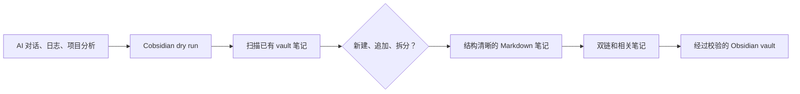
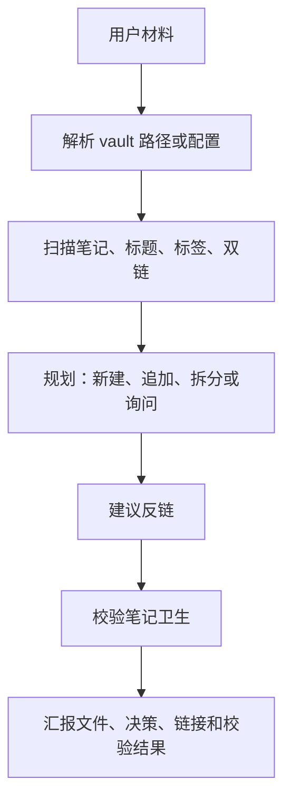

# Cobsidian

[English](../README.md) | 简体中文

[](https://github.com/Totoro-qaq/Cobsidian/actions/workflows/validate.yml)
[](https://github.com/Totoro-qaq/Cobsidian/actions/workflows/codeql.yml)
[](../LICENSE)

<p align="center">
  
</p>

> 安全地把 AI 对话整理成带双链的 Obsidian 知识库。

Cobsidian 是一个 agent-agnostic 的 Obsidian / Markdown 知识库维护工作流 Skill。它让 Agent 把对话、学习材料、日志、文档和项目分析整理成长期可维护的笔记，并在写入前检查重复内容、补充 `[[双链]]`、建议反链、做基础校验。

[快速开始](#快速开始) · [MCP Server](mcp-server.zh-CN.md) · [Prompt Examples](../examples/prompts.md) · [Agent 兼容性](agent-compatibility.zh-CN.md)

<p align="center">
  
</p>

## Cobsidian 做什么

- 把 AI 对话里有复用价值的内容整理成长期可维护的 Markdown 笔记。
- 写入前先扫描已有笔记，优先追加或合并，减少重复笔记。
- 通过 dry-run、反链建议和校验结果，让 Agent 写入变得可审阅。

## 快速开始

```bash
git clone https://github.com/Totoro-qaq/Cobsidian.git
cd Cobsidian
python skills/cobsidian/scripts/dry_run.py examples/demo-vault --topic "AI Conversations" --text "agent workflow notes" --json
```

然后让 Agent 读取 `skills/cobsidian/SKILL.md`，并提供 vault 路径或 `cobsidian.config.yml`。

```text
Use Cobsidian to organize this material into my Obsidian vault.
Vault: /absolute/path/to/obsidian-vault
Run a dry run first, check duplicates, suggest backlinks, and wait for confirmation before writing.
```

## 前后对比



| 使用前 | 使用后 |
|---|---|
| 有价值内容留在聊天记录里 | 进入你的 Obsidian vault |
| 零散 Markdown 文件 | 带 `[[双链]]` 的知识网络 |
| 重复问一次就多一篇重复笔记 | 先判断新建、追加还是拆分 |
| Agent 直接写入，不好审 | dry-run 先给计划，再确认写入 |

## Dry-run 预览

Dry run 是默认安全路径：只规划，不写文件；它会报告重复风险、目标笔记和建议反链，并保持 `writes` 为空。

```json
{
  "dry_run": true,
  "mode": "learning",
  "decision": {
    "action": "append",
    "target_note": "AI Conversations.md"
  },
  "suggested_backlinks": [
    {
      "title": "Agent Workflows",
      "path": "Agent Workflows.md"
    }
  ],
  "writes": []
}
```

## 不是普通 Markdown 生成器

| 普通 Markdown 生成 | Cobsidian |
|---|---|
| 生成一篇孤立文件 | 维护一个带链接的知识系统 |
| 不看已有笔记 | 写入前扫描 vault |
| 容易重复建主题 | 优先判断追加、合并或拆分 |
| 链接靠临场发挥 | 根据已有笔记建议反链 |
| 直接写入 | 支持 dry-run 审阅后再写 |

## Obsidian Vault 工作流



## 功能

- 创建学习笔记、项目笔记、对比笔记、索引笔记。
- 写入前检查已有笔记，减少重复。
- 根据笔记标题、元数据和正文建议 `[[双链]]` 与 Related notes 区块。
- 使用确定性的中文 bigram/trigram 匹配相关短语。
- 校验缺失的 wiki-link 目标。
- 检测完全重复或高度相似的笔记标题。
- 保持笔记结构简洁、可复用。
- 默认避免写入私人路径、密钥和原始聊天流水。
- 提供带分页的本地 MCP tools，用于只读检查和 dry-run 规划。

## 安装

完整安装、更新和卸载说明见 [INSTALL.md](../INSTALL.md)。
Codex、Obsidian vault、MCP host 和其他 Agent 的接入方式见 [集成说明](integrations.zh-CN.md)。

### Codex Skill

把 skill 目录复制到 Agent 的 skills 目录：

```bash
mkdir -p ~/.agents/skills
cp -r skills/cobsidian ~/.agents/skills/cobsidian
```

Windows PowerShell：

```powershell
New-Item -ItemType Directory -Force "$env:USERPROFILE\.agents\skills" | Out-Null
Copy-Item -Recurse -Force .\skills\cobsidian "$env:USERPROFILE\.agents\skills\cobsidian"
```

Codex 当前官方文档里的用户级 skill 目录是 `$HOME/.agents/skills`。部分本地或旧版 Codex 构建可能扫描 `$HOME/.codex/skills`；以你正在使用的 Codex surface 显示的 skills 目录为准。

### 其他 Agent

Hermes、Claude Code、Cursor 和其他 Agent 使用同一套核心工作流：

1. 让 Agent 读取 `skills/cobsidian/SKILL.md`。
2. 允许它调用 `skills/cobsidian/scripts/` 里的辅助脚本。
3. 要求它汇报新建/追加判断、重复检查、反链改动和校验结果。

详见 [Agent 兼容性](agent-compatibility.zh-CN.md) 和 [集成说明](integrations.zh-CN.md)。

### MCP Server

Cobsidian 也提供本地 MCP server，适合支持 Model Context Protocol 的 host 使用。

```bash
python -m pip install -r requirements-mcp.txt
python skills/cobsidian/mcp_server.py
```

建议作为本地 `stdio` server 使用，并配置 `COBSIDIAN_CONFIG` 或 `COBSIDIAN_VAULT`。

详见 [MCP Server](mcp-server.zh-CN.md)。

## Agent 用法

可直接复制的提示词见 [Prompt Examples](../examples/prompts.md)。

当你希望 Agent 把材料写入 Obsidian 时，可以这样说：

```text
Use Cobsidian to turn this conversation into an Obsidian learning note.
Check whether it should create a new note or append to an existing one.
Add useful wiki links and report possible duplicates.
```

更多例子：

```text
Use Cobsidian to summarize these logs into my Obsidian vault.
Preserve only reusable lessons, check for existing related notes, and add backlinks.
```

```text
Use Cobsidian to compare these two project attempts and write a comparison note.
If a related note already exists, append instead of creating a duplicate.
```

## 模式

Cobsidian 支持模式选择，用户可以直接告诉 Agent 想生成哪类笔记。

| 模式 | 适用场景 | 示例提示词 |
|---|---|---|
| 学习模式 | 学习概念、课程、论文、视频、技术主题。 | `用 Cobsidian 学习模式整理这段解释。` |
| 项目模式 | 整理项目、仓库、架构、实现、运维过程。 | `用 Cobsidian 项目模式总结这次源码分析。` |
| 复盘模式 | 复盘事故、失败实验、技术决策、运行结果。 | `用 Cobsidian 复盘模式整理这次失败原因。` |
| 对比模式 | 对比工具、架构、模型、库、数据库或方案。 | `用 Cobsidian 对比模式比较这些选型。` |
| 索引模式 | 建主题地图、学习路线、总览页、导航页。 | `用 Cobsidian 索引模式做一个知识地图。` |
| 日常捕获模式 | 先快速保存碎片材料，后续再深度整理。 | `用 Cobsidian 日常捕获模式先记下来。` |
| 拆解模式 | 拆解工具、框架、仓库、skill、提示词系统或源码。 | `用 Cobsidian 拆解模式分析这个 Agent 框架。` |

如果用户不指定模式，Agent 应该自动推断，并在结果里说明选择了哪个模式。

如果请求不明确，Agent 应该在交互中主动介绍模式选项，而不是默认用户已经读过 README。

详见 [模式说明](modes.zh-CN.md)。

## CLI 工具

需要确定性检查时，可以直接运行脚本：

```bash
python skills/cobsidian/scripts/scan_vault.py /path/to/vault --json
python skills/cobsidian/scripts/find_duplicates.py /path/to/vault
python skills/cobsidian/scripts/suggest_backlinks.py /path/to/vault --file draft.md
python skills/cobsidian/scripts/validate_notes.py /path/to/vault
python skills/cobsidian/scripts/dry_run.py /path/to/vault --topic "RAG" --text "draft text" --json
```

当配置里写了 `vault.path` 时，这些脚本也支持 `--config cobsidian.config.yml`。

## 可选配置

`cobsidian.config.example.yml` 是 `v0.4.0` 实际支持的配置面，包含 vault 路径、默认模式、模式目录、反链数量、重复阈值与追加偏好，以及校验行为。需要复用本地设置时，可以复制为 `cobsidian.config.yml`。

辅助脚本可以通过 `--config` 读取这个文件。

命名模板、脱敏和写入策略尚未由配置强制执行，仍属于路线图内容。

## 路线图

- 超越标题相似度的语义重复检测。
- 支持使用 YAML frontmatter 的 vault。
- 可选笔记模板。
- 可配置命名规则。
- 更安全的 dry-run 模式。
- Hermes、Claude Code、Cursor 的轻量适配层。
- 工作流稳定后再考虑 Obsidian 插件集成。

## 贡献

欢迎贡献。请阅读 [CONTRIBUTING.md](../CONTRIBUTING.md)。

不要提交私人知识库内容、个人路径、API key、未公开笔记或私人知识库截图。

## 商标和独立性声明

Cobsidian 是独立开源项目。OpenAI、Codex、Obsidian、Claude、Cursor、Hermes 以及其他名称均属于各自权利人。本项目不隶属于这些权利人，也未获得其背书或赞助。

## License

MIT. See [LICENSE](../LICENSE).
