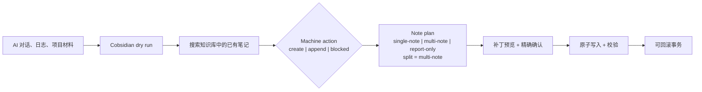
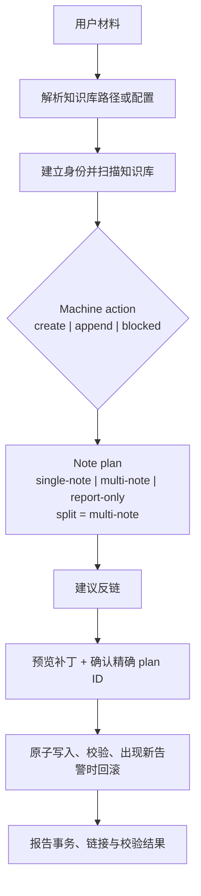

# Cobsidian

[English](../README.md) · 简体中文

<p align="center">
  
</p>

<p align="center">
  <a href="https://github.com/Totoro-qaq/Cobsidian/actions/workflows/validate.yml"></a>
  <a href="https://github.com/Totoro-qaq/Cobsidian/actions/workflows/codeql.yml"></a>
  <a href="../LICENSE"></a>
</p>

> 安全地把 AI 对话整理成带双链的 Obsidian 知识库。

Cobsidian 是一个不绑定 Agent 的 Obsidian / Markdown 知识库维护工作流 Skill。它先搜索再新建，解释准备执行的改动，等待精确确认，原子写入，并校验结果。

它不是托管服务，也不是 Obsidian 插件。你的编程 Agent 会在本机的 Markdown 文件夹上执行这套工作流。

[快速开始](#快速开始) · [安装](#安装) · [MCP Server](mcp-server.zh-CN.md) · [Prompt Examples](../examples/prompts.md) · [Agent 兼容性](agent-compatibility.zh-CN.md)

用你熟悉的 Agent 就行：[Claude Code](../skills/cobsidian/references/hosts/claude-code.md) · [Codex CLI](../skills/cobsidian/references/hosts/codex.md) · [GitHub Copilot CLI](../skills/cobsidian/references/hosts/github-copilot-cli.md) · [Kimi Code](../skills/cobsidian/references/hosts/kimi-code.md) · [OpenCode](../skills/cobsidian/references/hosts/opencode.md) · [Pi](../skills/cobsidian/references/hosts/pi.md) · [Antigravity](../skills/cobsidian/references/hosts/antigravity.md)

<p align="center">
  
</p>

<p align="center"><sub>演示使用合成知识库，不包含私人笔记、路径或凭据。</sub></p>

## 快速开始

先在自带的演示知识库上执行一次只读 dry run：

```bash
git clone https://github.com/Totoro-qaq/Cobsidian.git
cd Cobsidian
python skills/cobsidian/scripts/dry_run.py examples/demo-vault --topic "AI Conversations" --mode learning --text "agent workflow notes" --json
```

然后让 Agent 读取 `skills/cobsidian/SKILL.md`：

```text
Use Cobsidian to organize this material into my Obsidian vault.
Vault: /absolute/path/to/obsidian-vault
Run a dry run first, check duplicates, suggest backlinks, and wait for confirmation before writing.
```

## Cobsidian 做什么

| 阶段 | Cobsidian 会明确展示什么 |
| --- | --- |
| 读取 | 解析知识库，并从文件名、H1、title 与 aliases 建立笔记身份。 |
| 决策 | 把 `create | append | blocked` 与笔记形态分开报告。 |
| 审阅 | 返回重复风险、反链建议和精确的补丁计划。 |
| 写入 | 要求确认 plan ID，原子写入、校验，并保留回滚能力。 |

最终产物是带有实用 `[[双链]]` 的长期 Markdown，而不是已有笔记的第二份副本。

## 前后对比



| 整理前 | 整理后 |
| --- | --- |
| 有价值的回答沉在聊天记录里 | 可复用笔记留在知识库中 |
| 重复提问不断生成相似笔记 | 写入前先匹配已有身份 |
| 边写边猜应该加什么链接 | 从真实知识库笔记中建议反链 |
| Agent 改动难以审计 | 每次写入前都有确定性计划 |

## Dry-run 预览

Dry run 是默认的安全路径：报告决策，同时保持 `writes` 为空。

```json
{
  "dry_run": true,
  "mode": "learning",
  "decision": {
    "action": "append",
    "target_note": "AI Conversations.md"
  },
  "suggested_backlinks": [
    {
      "title": "Agent Workflows",
      "path": "Agent Workflows.md"
    }
  ],
  "writes": []
}
```

## 不是普通 Markdown 生成器

| 普通 Markdown 生成 | Cobsidian |
| --- | --- |
| 产出一个孤立文件 | 维护相互连接的知识系统 |
| 忽略已有笔记 | 写入前扫描知识库 |
| 混在一起判断动作和文档形态 | 分开报告 machine action 与 note plan |
| 立即写入 | 规划、确认、写入、校验，并可回滚 |

## Knowledge Read / 整理判读

写入前，Cobsidian 会计算 Knowledge Read：模式、深度、笔记粒度、证据与展示方式。`auto | always | off` 只控制对话中的展示；设为 `off` 时 `display_style` 会隐藏，但 dry-run 仍保留完整 JSON。

Capability-based degradation 会让结果忠实于真实能力：本地主机通过检查后可以进入 ready，MCP 保持只读，chat-only 主机只能返回草稿或请求可用路径，不会声称已经完成无法执行的工作。详细规则见 [mode 和 host references](../skills/cobsidian/references/)与共享的 [preflight contract](../skills/cobsidian/references/preflight.md)。

### Compact Knowledge Read

```json
{
  "mode": "learning",
  "mode_explicit": true,
  "recommended_modes": [],
  "depth": "standard",
  "granularity": "single-note",
  "evidence": "conversation",
  "display_policy": "auto",
  "display_style": "compact"
}
```

### Expanded Knowledge Read

```json
{
  "mode": "dissection",
  "mode_explicit": false,
  "recommended_modes": [],
  "depth": "deep",
  "granularity": "multi-note",
  "evidence": "source-grounded",
  "display_policy": "auto",
  "display_style": "expanded"
}
```

## Obsidian Vault 工作流



## 安装

需要 Git、Python 3.10+、一个 Markdown 知识库，以及能够读取本地说明和运行命令的编程 Agent。

先预览安装位置，再为支持的 CLI 安装 Skill：

```bash
python install_cobsidian.py --host all --scope user --dry-run --json
python install_cobsidian.py --host all --scope user
```

也可以手动复制到共享 Skill 目录：

```bash
mkdir -p ~/.agents/skills
cp -r skills/cobsidian ~/.agents/skills/cobsidian
```

Windows、项目级安装、软链接、更新与卸载见 [INSTALL.md](../INSTALL.md)；不同主机的发现路径见 [Integrations](integrations.zh-CN.md)。

### MCP Server

支持 Model Context Protocol 的主机可以把 Cobsidian 作为本地只读 `stdio` server 运行：

```bash
python -m pip install -r requirements-mcp.txt
python skills/cobsidian/mcp_server.py
```

配置 `COBSIDIAN_CONFIG` 或 `COBSIDIAN_VAULT`；详见 [MCP Server](mcp-server.zh-CN.md)。

## Agent 用法

告诉 Agent 使用什么工作流、操作哪个知识库，以及安全边界：

```text
Use Cobsidian to turn this conversation into an Obsidian learning note.
Check whether it should create a new note or append to an existing one.
Add useful wiki links, report possible duplicates, and wait before writing.
```

更多可直接复制的写法见 [Prompt Examples](../examples/prompts.md)。

## 模式

Cobsidian 接受显式模式，也能按自然语言路由。意图清晰时只推断一个模式；有歧义时最多推荐两个相关模式。参见[模式说明](modes.zh-CN.md)和详细的 [mode references](../skills/cobsidian/references/modes/)。

## CLI 工具

确定性工具覆盖知识库扫描、重复检测、反链建议、校验、dry run、事务准备、精确计划应用与质量评估：

```bash
python skills/cobsidian/scripts/scan_vault.py /path/to/vault --json
python skills/cobsidian/scripts/find_duplicates.py /path/to/vault
python skills/cobsidian/scripts/suggest_backlinks.py /path/to/vault --file draft.md
python skills/cobsidian/scripts/validate_notes.py /path/to/vault
python skills/cobsidian/scripts/write_executor.py prepare /path/to/vault --action append --target-note "RAG.md" --content-file draft.md --plan-out /tmp/cobsidian-plan.json
python skills/cobsidian/scripts/write_executor.py apply /path/to/vault --plan /tmp/cobsidian-plan.json --confirm PLAN_ID --json
```

## 可选配置

`cobsidian.config.example.yml` 是当前支持的配置面，包含知识库路径、模式目录、Knowledge Read 展示、反链数量、重复阈值、追加偏好与校验行为。

```yaml
interaction:
  knowledge_read: auto
```

复制为 `cobsidian.config.yml` 后，辅助脚本可以通过 `--config cobsidian.config.yml` 读取。

## 功能

- 基于文件名、H1、title 与 aliases 的确定性身份匹配，支持去前缀核心标题。
- 用 CJK bigram / trigram 匹配中文相关短语。
- 校验缺失双链目标和相似标题。
- 通过分页的本地 MCP 工具执行检查与 dry-run 规划。
- 完整性哈希补丁、精确确认、原子写入与回滚。
- 公开评估重复检测、反链、追加目标与模式准确率。

## 路线图

- 超越标题身份的语义重复检测。
- 用更大的标注知识库基准调优反链排序。
- 可选笔记模板与可配置命名规则。
- 工作流稳定后再考虑 Obsidian 插件集成。

## 贡献

欢迎贡献。请先阅读 [CONTRIBUTING.md](../CONTRIBUTING.md)，并且不要提交私人知识库内容、本机用户路径、API key、未公开笔记或个人截图。

## 商标和独立性声明

Cobsidian 是独立开源项目。OpenAI、Codex、Obsidian、Claude、Cursor、Hermes 以及其他名称均属于各自权利人。本项目不隶属于这些权利人，也未获得其背书或赞助。

## License

[MIT](../LICENSE) © 2026 Totoro。
